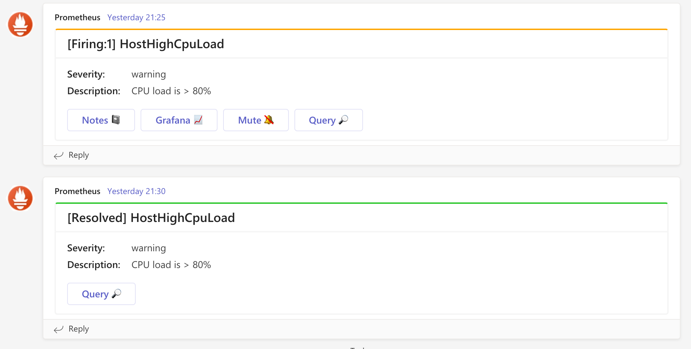

# Prometheus-msteams

## Overview

A lightweight Go Web Server that receives POST alert messages from Prometheus Alert Manager and sends it to a Microsoft Teams Channel using an incoming webhook url.

[Github project link](https://github.com/prometheus-msteams/prometheus-msteams)

## Requirements

"Actions" (buttons) are based on several keys define in "annotations" sections. If key does not exist, the button is not show.

* Grafana: base on annotations.grafana key.
* Notes: base on annotations.notes key.

**NOTES >> for "Query" and "Mute" action, the link a setup by autogenerate link "GeneratorURL" and "ExternalURL".**

## Preview

## Add emoji in MSTeam card

To add Emoji in yout MSTeam card, you nedd to add `&#x` with the unicode of your emoji:

Example for grinning face :smiley: -> `&#x1F600`.

You can find the full emoji list on this [page](https://unicode.org/emoji/charts/full-emoji-list.html).
